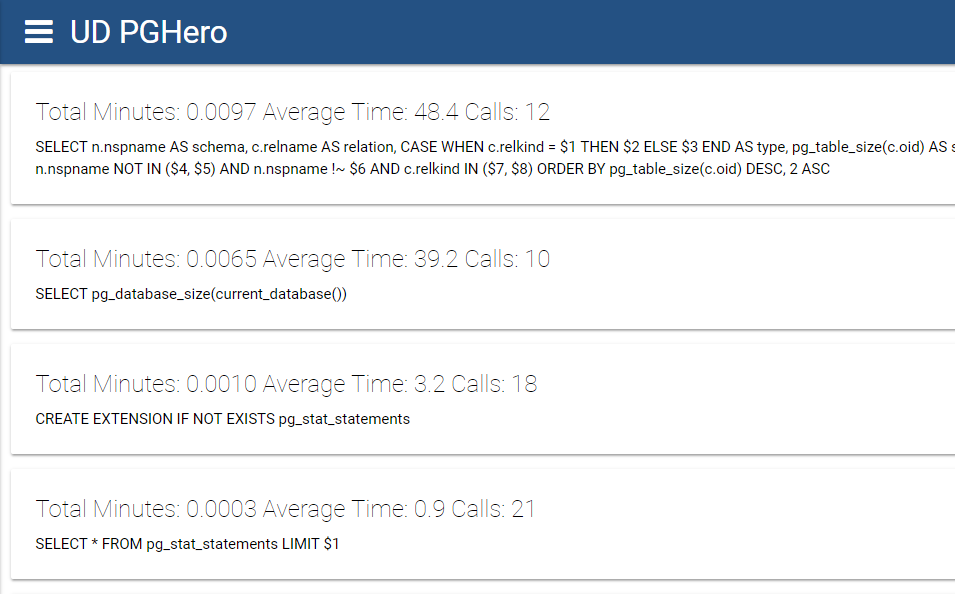
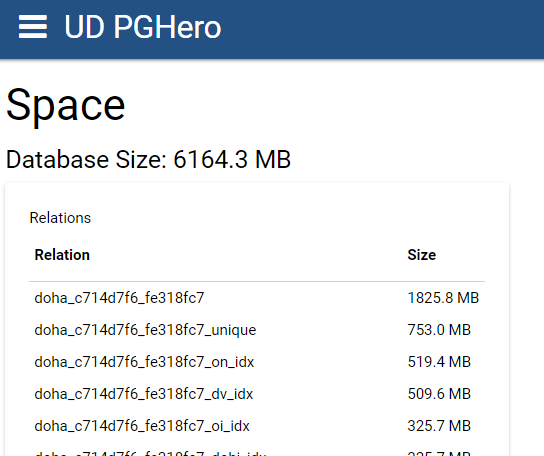
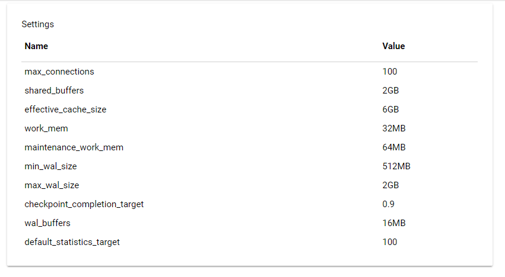

# UD-PGHero

## [PGHero](https://github.com/ankane/pghero) clone built in PowerShell and on [Universal Dashboard](https://ironmansoftware.com/powershell-universal-dashboard/)

# Usage

```
Import-Module ud-pghero
Start-UDPostgreSQLDashboard -ConnectionString "Server=localhost;Port=5432;User Id=pgadmin;Password=pgadmin" -Port 1000
```

# Connections

## View active connections group by user and database. View top sources. 


# Maintenance

## View last vacuum and analyze runs for tables. 


# Queries

## View queries stats.



# Space

## View relation space



# Tune

## View various tuning settings.

